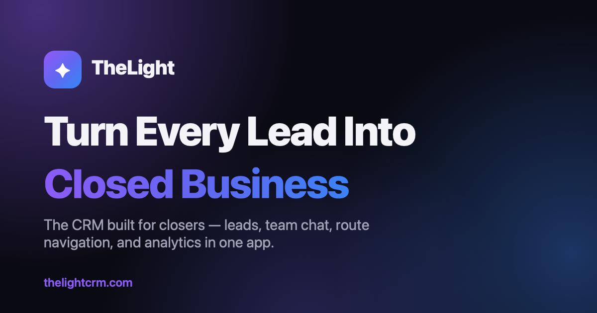

## Hi, I'm Peter 👋 — I build **TheLight**

### The all-in-one CRM that helps small businesses see their business clearly.

Leads, customers, sales pipeline, scheduling, invoices, maps, and team messaging. On the web, iPhone, iPad, and Mac.

---

### ☀️ Why teams choose TheLight

| | |
| --- | --- |
| 👥 **One place for every customer** | Leads, customers, vendors, and employees with full history and follow-ups |
| 📋 **A pipeline you can see** | Kanban board from first call to completed job |
| 📊 **Know your numbers** | Revenue, conversions, salesperson performance, and forecasting |
| 💬 **Stay in touch automatically** | Team chat, bulk email/SMS, and follow-up sequences |
| 💵 **Get paid faster** | Professional quotes and invoices with online payments |
| 🗺️ **Built for the field** | Maps, routes, geofencing, and a native iPhone app |

---

### 🧩 Use it anywhere

| Platform | Where |
| --- | --- |
| 🌐 **Web** | [app.thelightcrm.com](https://app.thelightcrm.com) |
| 📱 **iPhone & iPad** | Native SwiftUI app |
| 💻 **Mac** | Runs natively on Apple silicon Macs |

---

### 👨‍💻 For engineers & hiring managers

I designed and built TheLight end to end as a solo developer: native apps, web app, backend, and billing.

- **Native multiplatform app:** one SwiftUI codebase for iPhone, iPad, and Mac, with Swift Charts dashboards, MapKit routing and geofencing, and full light/dark support
- **Production web app:** React + TypeScript + Vite + Tailwind, sharing a live Firebase backend with the iOS app
- **Multi-tenant backend:** Firebase Auth, Cloud Firestore, Storage, and Cloud Functions, with per-company data isolation enforced in security rules and covered by rules unit tests
- **Real payments:** Stripe invoice payments live in production, with subscription plan tiers enforced on both client and server
- **Ship-ready practices:** App Store privacy manifest, secrets kept out of source via config templates, automated tests with Vitest

🔒 Source code is private. Happy to walk through it on a call or share access on request.

---

**🛠 Built with**

 
📫 Questions or a demo? <a href="https://thelightcrm.com/#contact">Get in touch</a>

