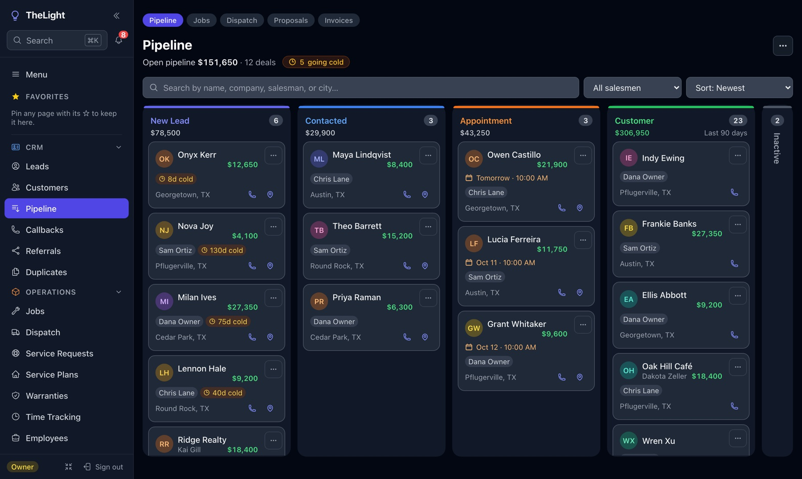
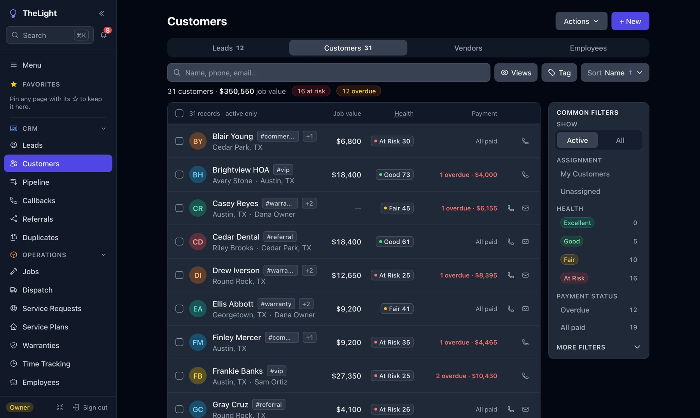
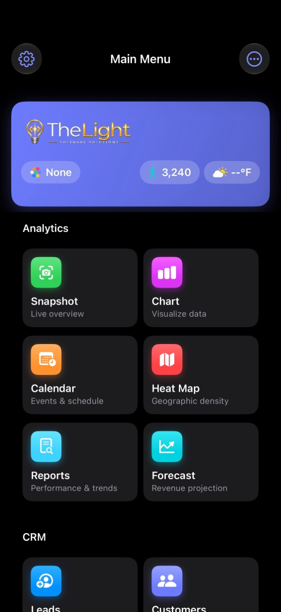
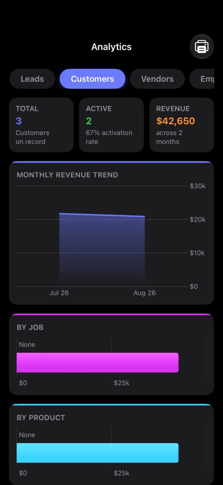
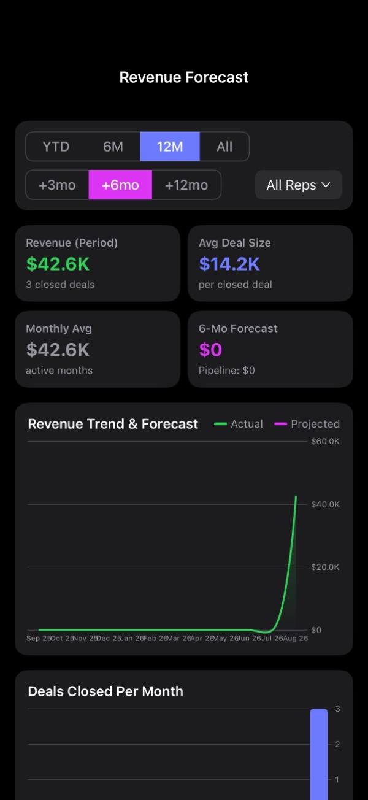
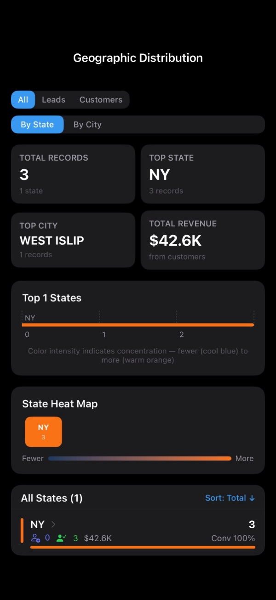

## From first call to final invoice.

TheLight is the all-in-one CRM for small businesses and field sales teams: leads, pipeline, scheduling, invoices, maps, and team chat in one app, on the web, iPhone, and iPad.

<a href="https://thelightcrm.com/crm">Website</a> · <a href="https://thelightcrm.com/crm#pricing">Pricing</a> · <a href="https://app.thelightcrm.com">Log in</a>

---

### Why teams choose TheLight

- **One place for every customer:** leads, customers, vendors, and employees with full history and follow-ups
- **A pipeline you can see:** a board from first call to completed job, with deals going cold flagged
- **Know your numbers:** revenue, conversions, salesperson performance, and forecasting
- **Stay in touch automatically:** team chat, bulk email and SMS, and follow-up sequences
- **Get paid faster:** professional quotes and invoices with online payments
- **Built for the field:** maps, routes, geofencing, and a native iPhone app

---

### A look inside

  
   
  <b>Pipeline:</b> every deal by stage, with appointments and leads going cold called out
    
  
   
  <b>Customers:</b> job value, health score, and overdue payments at a glance
   
  Web screenshots use a demo company; all names are invented.

 

#### On iPhone and iPad

<table>
  <tr>
    <td align="center"> <b>Main Menu</b></td>
    <td align="center"> <b>Analytics</b></td>
  </tr>
  <tr>
    <td align="center"> <b>Revenue Forecast</b></td>
    <td align="center"> <b>Heat Map</b></td>
  </tr>
</table>
Native SwiftUI app with live dashboards built with Swift Charts

---

### For engineers and hiring managers

I designed and built TheLight end to end as a solo developer: native app, web app, backend, and billing.

- **Native app:** one SwiftUI codebase for iPhone and iPad, with Swift Charts dashboards, MapKit routing and geofencing, and full light and dark support. It also runs on Apple silicon Macs as the iPad app.
- **Production web app:** React, TypeScript, Vite, and Tailwind, sharing a live Firebase backend with the iOS app
- **Multi-tenant backend:** Firebase Auth, Cloud Firestore, Storage, and Cloud Functions, with per-company data isolation enforced in security rules and covered by rules unit tests
- **Real payments:** Stripe invoice payments live in production, with subscription plan tiers enforced on both client and server
- **Ship-ready practices:** App Store privacy manifest, secrets kept out of source via config templates, automated tests with Vitest

Runs on the web at [app.thelightcrm.com](https://app.thelightcrm.com), on iPhone and iPad, and on Apple silicon Macs.

Source code is private. Happy to walk through it on a call or share access on request.

 

  

**Get in touch:** [eunitedws@gmail.com](mailto:eunitedws@gmail.com) · [Request a demo](https://thelightcrm.com/crm#demo)

